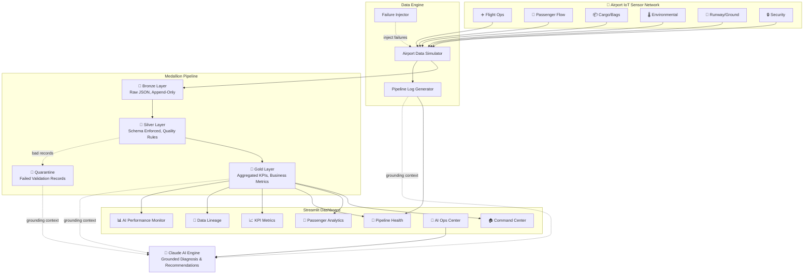

# AeroOps AI — Smart Airport IoT DataOps Dashboard

**Duration:** 2025 (POC — Data Engineering / AI Portfolio Project)
**Type:** IoT / Data Engineering / AI / Dashboard Project
**Tech Stack:** Streamlit, Plotly, Pandas, DuckDB, Parquet, Claude API (Anthropic SDK)

---

## 1. Overview

**What:** A Streamlit dashboard that monitors a smart airport's IoT sensor network through a Bronze → Silver → Gold medallion pipeline — visualizing flight operations, passenger flow, cargo processing, environmental conditions, runway status, and security systems — with Claude AI providing grounded incident diagnosis and pipeline optimization recommendations.

**Why:** Demonstrates end-to-end understanding of IoT ETL pipelines, KPI identification, data governance, observability, and AI-ready platform design — inspired by real-world airport IoT case studies (200+ destinations, sensor data lake, metadata lineage, real-time analytics).

**Target Audience:** Data engineering leaders evaluating: IoT ETL understanding, KPI identification, Streamlit visualization, Claude AI integration, and design mindset.

**Core Narrative:** The dashboard tells one coherent story: **Detect → Diagnose → Assess → Recommend**
1. Normal state: events flowing, pipeline healthy, KPIs green
2. Injected problem: sensor drift / device failure / traffic spike
3. Silver quality drops: validation failures, quarantine spikes
4. Gold KPI impact: freshness SLA breached, downstream analytics unreliable
5. Dashboard surfaces: which layer broke, what's impacted (lineage)
6. Claude AI explains: root cause + recommended remediation

---

## 2. Architecture

### System Architecture Diagram

```
┌──────────────────────────────────────────────────────────────────────┐
│                    AeroOps AI — Smart Airport                        │
│                 IoT DataOps Dashboard Architecture                   │
│                                                                      │
│  ┌────────────────────────────────────────────────────────┐          │
│  │              AIRPORT IoT SENSOR NETWORK                 │          │
│  │                                                         │          │
│  │  ✈️ Flight Ops    👥 Passenger Flow   📦 Cargo/Bags     │          │
│  │  🌡️ Environmental  🛬 Runway/Ground   🔒 Security       │          │
│  │                                                         │          │
│  │  [Data Simulator + Failure Injector]                    │          │
│  │   Normal mode: realistic airport telemetry              │          │
│  │   Chaos mode: schema drift, sensor outage, spikes       │          │
│  └─────────────────────┬──────────────────────────────────┘          │
│                        │                                              │
│            ┌───────────┴───────────┐                                  │
│            ▼                       ▼                                  │
│  ┌──────────────────┐   ┌──────────────────────┐                     │
│  │   BRONZE LAYER   │   │  PIPELINE LOG ENGINE  │                    │
│  │ Raw JSON events  │   │  ETL run history      │                    │
│  │ Append-only      │   │  Stage durations      │                    │
│  │ No transforms    │   │  Validation results   │                    │
│  │ All 6 streams    │   │  Error traces         │                    │
│  └────────┬─────────┘   └──────────┬───────────┘                     │
│           │                        │                                  │
│           ▼                        │                                  │
│  ┌──────────────────┐              │                                  │
│  │   SILVER LAYER   │              │                                  │
│  │ Schema enforced  │              │                                  │
│  │ Quality rules    │              │                                  │
│  │ Nulls/ranges     │              │                                  │
│  │ Bad → quarantine │              │                                  │
│  │ Enriched/typed   │              │                                  │
│  └────────┬─────────┘              │                                  │
│           │                        │                                  │
│           ▼                        │                                  │
│  ┌──────────────────┐              │                                  │
│  │    GOLD LAYER    │              │                                  │
│  │ Aggregated KPIs  │              │                                  │
│  │ Business metrics │              │                                  │
│  │ SLA tracking     │              │                                  │
│  │ Trend tables     │              │                                  │
│  └────────┬─────────┘              │                                  │
│           │                        │                                  │
│      ┌────┴────────────────────────┘                                  │
│      ▼                                                                │
│  ┌────────────────────────────────────────────────────────┐           │
│  │            STREAMLIT DASHBOARD (7 Pages)                │           │
│  │                                                         │           │
│  │  🏠 Command Center — health, alerts, events             │           │
│  │  👥 Passenger Analytics — OTP, throughput, flow         │           │
│  │  🔧 Pipeline Health — ETL runs, durations, errors       │           │
│  │  📈 KPI Metrics — quality, SLA, governance              │           │
│  │  🔗 Data Lineage — B→S→G impact tracking                │           │
│  │  🤖 AI Ops Center — Claude diagnosis & advice           │           │
│  │  📊 AI Performance Monitor — LLM usage analytics        │           │
│  └───────────────────────┬─────────────────────────────────┘           │
│                          │                                            │
│                          ▼                                            │
│  ┌────────────────────────────────────────────────────────┐           │
│  │                   CLAUDE AI ENGINE                      │           │
│  │  Grounded on: pipeline logs, KPI trends, validation     │           │
│  │  failures, schema events, lineage context               │           │
│  │                                                         │           │
│  │  Answers: What changed? What broke? What's impacted?    │           │
│  │           What should the operator do next?             │           │
│  └────────────────────────────────────────────────────────┘           │
└──────────────────────────────────────────────────────────────────────┘
```

### Mermaid Architecture (for presentations)



### Architecture Walkthrough (Verbal)

> "AeroOps AI is built as a three-layer medallion architecture simulating a smart airport IoT platform. Six IoT sensor streams — flights, passengers, cargo, environmental, runway, and security — feed into a Bronze layer as raw JSON events. A Silver transformation layer enforces schemas, applies quality validation rules per stream, and quarantines bad records. The Gold layer computes aggregated business KPIs: flight on-time performance, passenger throughput, security response times, and data quality scores. A Streamlit dashboard with seven pages visualizes this end-to-end — from system health to AI-powered diagnosis and LLM performance monitoring. Claude AI provides grounded recommendations based on actual pipeline logs, KPI trends, and lineage context — not generic advice. The system includes injectable failure scenarios that demonstrate observability: schema drift, sensor outages, and traffic spikes propagate through the pipeline and the dashboard surfaces exactly what broke and what's impacted downstream."

---

## 3. Tech Stack

| Layer | Technology | Why Chosen |
|-------|-----------|------------|
| **Frontend** | Streamlit | Explicitly requested by interviewer; rapid dashboard prototyping |
| **Visualizations** | Plotly + Altair | Plotly: interactive charts, gauges, Sankey diagrams. Altair: declarative, Streamlit-native |
| **Data Processing** | Pandas + DuckDB | Pandas for transformations; DuckDB for SQL analytics on Parquet (simulates lakehouse queries) |
| **Data Storage** | Parquet files (Bronze/Silver/Gold dirs) | Columnar format, realistic medallion layer simulation, no cloud dependency |
| **Data Simulation** | Python (Faker + custom generators) | Realistic IoT events with configurable chaos/failure injection |
| **AI/ML** | Claude API (Anthropic SDK) | Workspace: "AeroOps"; grounded on pipeline data, not a generic chatbot |
| **Deployment** | Streamlit Community Cloud | Free hosting, deploys from GitHub, zero infrastructure management |
| **Version Control** | Git + GitHub | varnika-98/AeroOps-POC |

### Why These Choices?

**DuckDB over SQLite/PostgreSQL:** DuckDB is designed for analytical queries on columnar data (Parquet). It mirrors how real data lakehouses query data — SQL on files, not SQL on rows. `SELECT * FROM read_parquet('data/gold/flight_kpis.parquet')` is the same pattern used in Microsoft Fabric and Databricks.

**Parquet over CSV/JSON:** Parquet is the standard storage format for medallion architectures in Fabric/Databricks/Synapse. Using Parquet shows awareness of real-world data engineering, not tutorial-level CSV manipulation.

**Claude over OpenAI:** Interviewer explicitly mentioned Claude. The API is straightforward, the Anthropic SDK is clean, and the system prompt approach is ideal for grounded enterprise AI.

---

## 4. Data Flow

### End-to-End Pipeline Flow

```
1. SIMULATION (simulator/)
   │
   ├── airport_generator.py
   │   Generates events for 6 IoT streams at configurable rates
   │   Normal mode: realistic patterns (peak hours, seasonal)
   │   Failure mode: injects drift, outages, spikes
   │
   ├── pipeline_log_generator.py
   │   Simulates ETL pipeline execution logs
   │   Records: start_time, end_time, status, records_processed, errors
   │
   └── failure_injector.py
       3 scenarios: schema drift, sensor outage, traffic spike

2. BRONZE INGESTION (pipeline/bronze_ingestion.py)
   │
   │   Input:  Raw JSON events from simulator
   │   Output: data/bronze/{stream}/events_{timestamp}.json
   │   Rules:  Append-only, no transformations, preserve raw data
   │   Logs:   Pipeline log entry per batch

3. SILVER TRANSFORMATION (pipeline/silver_transformation.py)
   │
   │   Input:  data/bronze/{stream}/*.json
   │   Output: data/silver/{stream}.parquet
   │   Rules per stream:
   │     - Schema enforcement (expected columns, types)
   │     - Null checks (required fields must be non-null)
   │     - Range validation (temperature: -50 to 60°C, heart rate: 0-300)
   │     - Enum validation (status fields match allowed values)
   │     - Timestamp validation (not in future, not > 24h old)
   │   Quarantine: data/quarantine/{stream}_quarantine.parquet
   │   Logs: Pipeline log entry with pass/fail counts

4. GOLD AGGREGATION (pipeline/gold_aggregation.py)
   │
   │   Input:  data/silver/*.parquet
   │   Output: data/gold/*.parquet
   │   Computes:
   │     - flight_kpis.parquet (OTP, delay stats, gate utilization)
   │     - passenger_kpis.parquet (throughput, wait times, checkpoint efficiency)
   │     - pipeline_kpis.parquet (success rate, latency, throughput)
   │     - quality_kpis.parquet (validation rates, quarantine %, freshness)
   │     - safety_kpis.parquet (response times, alert counts, resolution rates)
   │   Logs: Pipeline log entry per aggregation table

5. DASHBOARD (app/)
   │
   │   Reads: data/gold/*.parquet, data/logs/*.parquet, data/quarantine/*.parquet
   │   Uses DuckDB for SQL queries on Parquet files
   │   6 Streamlit pages render visualizations

6. AI ENGINE (ai/)
   │
   │   Input:  Pipeline logs + KPI trends + validation failures + lineage context
   │   Output: Natural language diagnosis, recommendations, chat responses
   │   Sends structured context to Claude API (not raw data dumps)
```

---

## 5. IoT Data Streams — Schema Definitions

### Stream 1: ✈️ Flight Operations

```python
flight_schema = {
    "event_id":        str,   # "FLT-20260419-001"
    "timestamp":       str,   # ISO 8601: "2026-04-19T10:30:00Z"
    "flight_id":       str,   # "AA1234"
    "gate":            str,   # "B22"
    "terminal":        str,   # "Terminal 2"
    "status":          str,   # scheduled | boarding | departed | arrived | delayed | cancelled
    "scheduled_time":  str,   # ISO 8601
    "actual_time":     str,   # ISO 8601 or null
    "delay_minutes":   int,   # 0 if on time
    "aircraft_type":   str,   # "B737-800"
    "passenger_count": int,   # Pax on manifest
}
```

**Quality rules (Silver):**
- `flight_id` must match pattern `[A-Z]{2}\d{3,4}`
- `status` must be one of 6 allowed values
- `delay_minutes` must be >= 0
- `scheduled_time` must not be null
- `passenger_count` must be between 1 and 600

### Stream 2: 👥 Passenger Flow

```python
passenger_schema = {
    "event_id":             str,   # "PAX-20260419-001"
    "timestamp":            str,   # ISO 8601
    "terminal":             str,   # "Terminal 1"
    "checkpoint":           str,   # "Security-A", "Gate-B22", "Check-in-C"
    "zone":                 str,   # "Departures-North"
    "passenger_count":      int,   # Current count in zone
    "wait_time_minutes":    float, # Current avg wait
    "throughput_per_hour":  int,   # Processing rate
    "queue_length":         int,   # Current queue size
}
```

**Quality rules (Silver):**
- `passenger_count` must be >= 0 and <= 5000
- `wait_time_minutes` must be >= 0 and <= 180
- `throughput_per_hour` must be >= 0
- `checkpoint` must not be null

### Stream 3: 📦 Cargo & Baggage

```python
cargo_schema = {
    "event_id":             str,   # "CGO-20260419-001"
    "timestamp":            str,   # ISO 8601
    "item_type":            str,   # baggage | cargo | mail
    "item_id":              str,   # "BAG-9928371"
    "flight_id":            str,   # Associated flight
    "scan_point":           str,   # "Conveyor-B3"
    "status":               str,   # checked_in | in_transit | loaded | delivered | lost
    "weight_kg":            float, # Item weight
    "processing_time_sec":  int,   # Time since check-in
}
```

**Quality rules (Silver):**
- `item_type` must be one of 3 allowed values
- `status` must be one of 5 allowed values
- `weight_kg` must be between 0.1 and 500
- `processing_time_sec` must be >= 0

### Stream 4: 🌡️ Environmental

```python
environmental_schema = {
    "event_id":          str,   # "ENV-20260419-001"
    "timestamp":         str,   # ISO 8601
    "terminal":          str,   # "Terminal 1"
    "zone":              str,   # "Gate-B22"
    "temperature_c":     float, # Celsius
    "humidity_pct":      float, # 0-100%
    "co2_ppm":           int,   # CO2 concentration
    "air_quality_index": int,   # AQI (0-500 scale)
    "hvac_status":       str,   # normal | degraded | offline
}
```

**Quality rules (Silver):**
- `temperature_c` must be between -10 and 50
- `humidity_pct` must be between 0 and 100
- `co2_ppm` must be between 200 and 5000
- `air_quality_index` must be between 0 and 500
- `hvac_status` must be one of 3 allowed values

### Stream 5: 🛬 Runway & Ground

```python
runway_schema = {
    "event_id":           str,   # "RWY-20260419-001"
    "timestamp":          str,   # ISO 8601
    "runway_id":          str,   # "09L/27R"
    "surface_temp_c":     float, # Surface temperature
    "wind_speed_kph":     float, # Wind speed in km/h
    "wind_direction_deg": int,   # 0-360 degrees
    "visibility_m":       int,   # Meters
    "friction_index":     float, # 0-1 scale
    "precipitation":      str,   # none | rain | snow | ice
    "runway_status":      str,   # active | maintenance | weather_hold
}
```

**Quality rules (Silver):**
- `wind_speed_kph` must be between 0 and 200
- `visibility_m` must be between 0 and 20000
- `friction_index` must be between 0 and 1
- `wind_direction_deg` must be between 0 and 360
- `precipitation` must be one of 4 allowed values
- `runway_status` must be one of 3 allowed values

### Stream 6: 🔒 Security Systems

```python
security_schema = {
    "event_id":          str,   # "SEC-20260419-001"
    "timestamp":         str,   # ISO 8601
    "checkpoint_id":     str,   # "SEC-T1-A"
    "alert_type":        str,   # routine_scan | anomaly | breach | device_alert
    "severity":          str,   # low | medium | high | critical
    "device_type":       str,   # "x_ray_scanner", "metal_detector", "cctv"
    "response_time_sec": int,   # Time to respond (null for routine)
    "resolution_status": str,   # auto_cleared | manual_review | escalated
    "zone":              str,   # "Terminal-1-Entry"
}
```

**Quality rules (Silver):**
- `alert_type` must be one of 4 allowed values
- `severity` must be one of 4 allowed values
- `resolution_status` must be one of 3 allowed values
- If `alert_type` is "breach" or "device_alert", `response_time_sec` must not be null
- `response_time_sec` must be >= 0 when present

---

## 6. KPI Definitions

### Tier 1: Core Pipeline KPIs

| KPI | Formula | Threshold | Unit |
|-----|---------|-----------|------|
| **Throughput** | `COUNT(events) / time_window_seconds` | > 100 events/sec = healthy | events/sec |
| **Ingestion Lag** | `bronze_timestamp - event_timestamp` | < 5 sec = healthy | seconds |
| **P95 Processing Latency** | `PERCENTILE(gold_timestamp - bronze_timestamp, 0.95)` | < 30 sec = healthy | seconds |
| **Pipeline Success Rate** | `COUNT(successful_runs) / COUNT(total_runs) * 100` | > 99% = healthy | percentage |
| **Data Quality Score** | `COUNT(silver_passed) / COUNT(bronze_total) * 100` | > 95% = healthy | percentage |
| **Events Processed** | `COUNT(events) GROUP BY stream, time_window` | Context-dependent | count |

### Tier 2: Governance & Observability KPIs

| KPI | Formula | Threshold | Unit |
|-----|---------|-----------|------|
| **Schema Validation Pass Rate** | `COUNT(schema_valid) / COUNT(total) * 100` per stream | > 98% = healthy | percentage |
| **Quarantined Records** | `COUNT(quarantine_records)` per stream per window | < 2% of total = healthy | count + % |
| **Gold Table Freshness** | `NOW() - MAX(gold_table.updated_at)` | < 5 min = healthy | minutes |
| **Anomaly Count** | `COUNT(readings outside expected_range)` per stream | Context-dependent | count |
| **Dropped/Late/Invalid Events** | `COUNT(non_completed) / COUNT(total) * 100` | < 1% = healthy | percentage |

### Tier 3: Airport Business KPIs

| KPI | Formula | Threshold | Unit |
|-----|---------|-----------|------|
| **Flight OTP** | `COUNT(delay_minutes <= 15) / COUNT(flights) * 100` | > 80% = good | percentage |
| **Passenger Throughput** | `SUM(throughput_per_hour)` across checkpoints | > 2000 pax/hr = healthy | pax/hour |
| **Avg Security Wait Time** | `AVG(wait_time_minutes)` across security checkpoints | < 15 min = good | minutes |
| **Baggage Processing Rate** | `COUNT(bags) / time_hours` | > 500 bags/hr = healthy | bags/hour |
| **Safety Incident Response** | `AVG(response_time_sec) WHERE alert_type IN ('breach','device_alert')` | < 120 sec = good | seconds |
| **Environmental Compliance** | `COUNT(in_range) / COUNT(total) * 100` for temp/AQI/CO2 | > 95% = compliant | percentage |
| **Runway Utilization** | `COUNT(active) / COUNT(total) * 100` across runways | > 85% = good | percentage |

---

## 7. Key Components

### Component A: Airport Data Simulator (`simulator/`)

- **Purpose:** Generate realistic IoT sensor events for all 6 airport streams with configurable rates, peak-hour patterns, and injectable failure scenarios.
- **Input:** Configuration (terminals, gates, runways, airlines, peak hours, failure scenario toggles)
- **Output:** JSON events written to `data/bronze/{stream}/` directories; pipeline log entries to `data/logs/`
- **Key Logic:**
  - Each stream has its own generator class with realistic distributions
  - Peak hours (7-9 AM, 5-7 PM) generate 2-3x normal event rates
  - Flight delays follow realistic patterns (weather-correlated, cascade effects)
  - Passenger flow correlates with flight departures/arrivals
  - Environmental readings follow diurnal temperature curves
  - Security events are mostly routine (95%) with rare anomalies (5%)

#### Airport Configuration

```python
AIRPORT_CONFIG = {
    "name": "AeroOps International Airport",
    "code": "AOP",
    "terminals": ["Terminal 1", "Terminal 2", "Terminal 3"],
    "gates_per_terminal": 20,
    "runways": ["09L/27R", "09R/27L", "04/22"],
    "security_checkpoints": ["SEC-T1-A", "SEC-T1-B", "SEC-T2-A", "SEC-T2-B", "SEC-T3-A"],
    "airlines": ["AA", "UA", "DL", "SW", "B6", "AS", "NK", "F9"],
    "aircraft_types": ["B737-800", "A320", "B777-300", "A350-900", "E175", "B787-9"],
    "peak_hours": [(7, 9), (11, 13), (17, 19)],
    "events_per_minute": {
        "flights": 2,
        "passengers": 10,
        "cargo": 5,
        "environmental": 8,
        "runway": 3,
        "security": 6,
    },
}
```

#### Failure Injector

```python
class FailureInjector:
    """Injectable failure scenarios with UI toggle support."""

    def inject_schema_drift(self, stream="runway"):
        """Runway sensor firmware changes wind_speed_kph to mph values."""
        # Multiplies wind_speed values by 1.6 (kph → mph conversion)
        # Silver validation catches: values like 40 mph reported as 40 kph
        # are normal, but 100 mph reported as 100 kph triggers range violation

    def inject_sensor_outage(self, stream="passengers", checkpoints=3):
        """3 of 8 security checkpoints in Terminal 1 go offline."""
        # Stops generating events for selected checkpoints
        # Bronze event count drops for passenger stream
        # Silver: incomplete data → throughput KPIs underreport

    def inject_traffic_spike(self, multiplier=3.0):
        """Holiday weekend: 3x event volume across all streams."""
        # Multiplies event generation rate by 3x
        # Silver processing can't keep up → pipeline latency increases
        # Gold freshness SLA breached
```

### Component B: Medallion Pipeline (`pipeline/`)

- **Purpose:** Process raw IoT events through Bronze → Silver → Gold layers with quality enforcement, quarantine, and KPI computation.
- **Input:** Raw JSON events in `data/bronze/`
- **Output:** Validated Parquet in `data/silver/`, aggregated KPIs in `data/gold/`, rejected records in `data/quarantine/`
- **Key Logic:**

#### Bronze Ingestion

```python
def ingest_to_bronze(stream_name: str, events: list[dict]) -> str:
    """Append raw events to Bronze layer as JSON files.

    - No transformations applied
    - Preserves raw data exactly as received
    - Adds _ingested_at metadata timestamp
    - Returns file path of written batch
    """
```

#### Silver Transformation

```python
def transform_to_silver(stream_name: str) -> dict:
    """Read Bronze, validate, and write to Silver Parquet.

    Returns:
        {
            "total_records": int,
            "passed": int,
            "failed": int,
            "quarantined": int,
            "quality_score": float,  # passed / total * 100
            "failure_reasons": dict,  # {rule_name: count}
        }
    """
```

Quality rules are defined per stream in `quality_rules.py`:

```python
QUALITY_RULES = {
    "flights": [
        {"rule": "flight_id_format", "field": "flight_id", "regex": r"^[A-Z]{2}\d{3,4}$"},
        {"rule": "status_enum", "field": "status", "allowed": ["scheduled","boarding","departed","arrived","delayed","cancelled"]},
        {"rule": "delay_non_negative", "field": "delay_minutes", "min": 0},
        {"rule": "passenger_range", "field": "passenger_count", "min": 1, "max": 600},
        {"rule": "scheduled_time_not_null", "field": "scheduled_time", "not_null": True},
    ],
    "runway": [
        {"rule": "wind_speed_range", "field": "wind_speed_kph", "min": 0, "max": 200},
        {"rule": "visibility_range", "field": "visibility_m", "min": 0, "max": 20000},
        {"rule": "friction_range", "field": "friction_index", "min": 0.0, "max": 1.0},
        # ... more rules
    ],
    # ... rules for each stream
}
```

#### Gold Aggregation

```python
def aggregate_to_gold() -> dict:
    """Compute Gold layer KPIs from Silver data.

    Produces:
        - flight_kpis.parquet: OTP, delay stats, gate utilization
        - passenger_kpis.parquet: throughput, wait times, checkpoint efficiency
        - pipeline_kpis.parquet: success rate, latency, throughput
        - quality_kpis.parquet: validation rates, quarantine %, freshness
        - safety_kpis.parquet: response times, alert counts
    """
```

Gold KPI computation uses DuckDB for SQL analytics on Silver Parquet:

```sql
-- Example: Flight On-Time Performance
SELECT
    DATE_TRUNC('hour', timestamp) AS hour,
    COUNT(*) AS total_flights,
    COUNT(*) FILTER (WHERE delay_minutes <= 15) AS on_time,
    ROUND(COUNT(*) FILTER (WHERE delay_minutes <= 15) * 100.0 / COUNT(*), 1) AS otp_pct
FROM read_parquet('data/silver/flights.parquet')
GROUP BY 1
ORDER BY 1;
```

#### Pipeline Orchestrator

```python
def run_pipeline(streams: list[str] = None) -> dict:
    """Execute full Bronze → Silver → Gold pipeline.

    1. Read new events from Bronze
    2. Apply Silver transformations per stream
    3. Compute Gold aggregations
    4. Log pipeline execution metrics
    5. Return summary with timing and quality metrics
    """
```

### Component C: Claude AI Engine (`ai/`)

- **Purpose:** Provide grounded, context-aware diagnosis and recommendations about airport data health using Claude API.
- **Input:** Pipeline logs, KPI metrics, validation failures, lineage context (structured, not raw data dumps)
- **Output:** Natural language analysis: what changed, what broke, what's impacted, what to do next.
- **Key Logic:**

#### Context Builder

```python
def build_ai_context() -> dict:
    """Assemble grounding context for Claude from live data.

    Returns structured context dict with:
    - pipeline_health: latest run results per stream (success/fail, duration, records)
    - kpi_summary: current KPI values vs. thresholds (which are breached?)
    - quality_issues: top validation failures, quarantine spike detection
    - anomalies: schema drift events, sensor outages, volume spikes
    - lineage_impact: which Gold KPIs are affected by current issues
    - recent_alerts: last N alerts sorted by severity
    """
```

#### System Prompt Design

```python
SYSTEM_PROMPT = """You are AeroOps AI, an intelligent operations assistant for a smart airport
IoT monitoring platform. You analyze data pipeline health, sensor network status, and operational
KPIs to help airport data engineers identify and resolve issues.

Your responses must be:
1. GROUNDED — Only reference data provided in the context. Never fabricate metrics.
2. SPECIFIC — Name exact streams, sensors, timestamps, and KPI values.
3. ACTIONABLE — Every diagnosis must include a concrete next step.
4. STRUCTURED — Use this format for incident analysis:
   - What changed: [specific event or metric shift]
   - What broke: [which pipeline stage, which validation rule]
   - What's impacted: [downstream KPIs and dashboards affected]
   - Recommended action: [specific remediation steps]

You understand medallion architecture (Bronze/Silver/Gold), data quality rules,
pipeline orchestration, and IoT sensor networks. You can trace data lineage
from any Gold KPI back to its Bronze source streams.

Current airport: AeroOps International Airport (AOP)
Streams: flights, passengers, cargo, environmental, runway, security
"""
```

#### Claude Client

```python
class ClaudeClient:
    def __init__(self):
        self.client = anthropic.Anthropic(api_key=os.getenv("ANTHROPIC_API_KEY"))
        self.model = os.getenv("CLAUDE_MODEL", "claude-sonnet-4-20250514")

    def diagnose(self, context: dict) -> str:
        """Send pipeline context to Claude for incident diagnosis."""

    def recommend(self, context: dict, question: str = None) -> str:
        """Get optimization recommendations from Claude."""

    def chat(self, messages: list, context: dict) -> str:
        """Interactive chat with grounding context."""
```

### Component D: Streamlit Dashboard (`app/`)

- **Purpose:** 6-page interactive dashboard visualizing airport operations, pipeline health, KPIs, lineage, and AI-powered diagnosis.
- **Key Design Principles:**
  - Airport-themed color scheme (navy, sky blue, safety orange, success green)
  - Consistent Plotly chart styling across all pages
  - Responsive layout using `st.columns()` for metric cards
  - Auto-refresh with configurable interval
  - Sidebar: stream filters, time range, failure scenario toggles

#### Page Specifications

**Page 1: 🏠 Command Center**
| Component | Chart Type | Data Source |
|-----------|-----------|-------------|
| System health per stream | Traffic light indicators (🟢🟡🔴) | Gold quality KPIs |
| Events processed | Metric cards with sparklines | Pipeline logs |
| Medallion layer health | Stacked bar (Bronze/Silver/Gold record counts) | Layer counts |
| Recent alerts | Scrollable feed with severity badges | Security + pipeline alerts |
| Live airport stats | Big number cards (flights, passengers, bags) | Gold KPIs |

**Page 2: 👥 Passenger Analytics**
| Component | Chart Type | Data Source |
|-----------|-----------|-------------|
| Flight OTP | Gauge (0-100%) + hourly trend line | Gold flight KPIs |
| Passenger flow heatmap | Heatmap (terminal × zone × congestion) | Silver passenger data |
| Checkpoint wait times | Bar chart per checkpoint | Silver passenger data |
| Throughput vs capacity | Line chart with threshold line | Gold passenger KPIs |
| Baggage funnel | Funnel chart (checked_in → loaded → delivered) | Gold cargo KPIs |
| Delay distribution | Histogram + top delay causes | Silver flight data |

**Page 3: 🔧 Pipeline Health & Logs**
| Component | Chart Type | Data Source |
|-----------|-----------|-------------|
| Pipeline run timeline | Gantt chart per stream | Pipeline logs |
| Success/failure trend | Stacked area chart | Pipeline logs |
| Duration by stage | Grouped bar (Bronze→Silver, Silver→Gold) | Pipeline logs |
| Log viewer | Searchable table (filter by stream/severity/time) | Pipeline logs |
| Duration regression | Line chart with trend detection | Pipeline logs |
| Throughput per stream | Multi-line chart | Pipeline logs |

**Page 4: 📈 KPI Metrics**
| Component | Chart Type | Data Source |
|-----------|-----------|-------------|
| Data quality score | Gauge + trend per stream | Gold quality KPIs |
| Schema validation rate | Bar chart per stream | Silver validation results |
| Quarantined records trend | Area chart per stream | Quarantine counts |
| Gold freshness | Indicator per table + SLA warning | Gold table metadata |
| Dropped/invalid events | Percentage chart per stream | Pipeline logs |
| Environmental compliance | Gauge (% within regulatory bounds) | Gold environmental KPIs |

**Page 5: 🔗 Data Lineage & Governance**
| Component | Chart Type | Data Source |
|-----------|-----------|-------------|
| Lineage flow | Sankey diagram (Bronze → Silver → Gold) | Pipeline metadata |
| Impact analysis | Dependency tree (if X fails → which KPIs stale?) | Lineage model |
| Quality rules table | DataTable (rule, stream, pass/fail, trend) | Quality rules results |
| Quarantine inspector | Expandable table (browse rejected records, see why) | Quarantine data |
| Data classification | Tag badges (PII, Security, Operational, Environmental) | Static metadata |
| Reverse lineage | Click a Gold KPI → trace to Bronze sources | Lineage model |

**Page 6: 🤖 AI Ops Center**
| Component | Chart Type | Data Source |
|-----------|-----------|-------------|
| System status summary | Text panel (auto-generated by Claude) | Claude + Gold KPIs |
| What changed? | Expandable alert cards | Claude + anomaly data |
| What broke? | Root cause analysis panel | Claude + pipeline logs |
| What's impacted? | Lineage-aware impact tree | Claude + lineage model |
| What should we do? | Recommendation cards with priority | Claude analysis |
| Chat interface | `st.chat_message` / `st.chat_input` | Claude interactive |
| Grounding context | Expandable "Show context sent to AI" | Context builder output |

**Page 7: 📊 AI Performance Monitor**
| Component | Chart Type | Data Source |
|-----------|-----------|-------------|
| Total Requests | Metric card | AI metrics JSON |
| Avg Latency | Metric card with threshold coloring | AI metrics JSON |
| Total Cost | Metric card (USD) | AI metrics JSON |
| Error Rate | Metric card (%) | AI metrics JSON |
| Latency by Prompt Type | Grouped bar chart | AI metrics JSON |
| Token Usage (Input vs Output) | Grouped bar chart per prompt type | AI metrics JSON |
| Cost Breakdown | Pie chart by prompt type | AI metrics JSON |
| Request Timeline | Time series line chart | AI metrics JSON |

---

## 8. Failure Scenarios (Detailed)

### Scenario 1: Runway Sensor Schema Drift

**Trigger:** Runway sensor firmware update changes `wind_speed_kph` field to report values in mph (but still labeled as kph).

**Propagation:**
1. **Bronze:** Events land normally — raw data preserved as-is
2. **Silver:** Quality rule `wind_speed_range` (0-200 kph) catches values like 65 (mph ≈ 105 kph reported as 65 kph — actually passes, but on a windy day 80 mph = 128 kph reported as 80 — still passes). However, when the sensor reports 120 mph as "120 kph", it exceeds the max and gets quarantined.
3. **Quarantine:** Spike in runway stream quarantine records
4. **Gold:** Runway utilization and weather safety KPIs degrade — unreliable weather data
5. **Dashboard:** Pipeline Health page shows runway stream quality drop; KPI page shows freshness SLA at risk
6. **Claude:** "Runway sensor RWY-09L values anomalous since 14:32 UTC. Wind speed readings inconsistent with meteorological data — values suggest mph, not kph. Recommend firmware version check and unit conversion rule."

### Scenario 2: Passenger Flow Sensor Outage

**Trigger:** 3 of 8 security checkpoint sensors in Terminal 1 go offline.

**Propagation:**
1. **Bronze:** Event count drops ~37% for passenger stream (3/8 checkpoints silent)
2. **Silver:** Data passes validation (what arrives is valid) but throughput calculations are incomplete
3. **Gold:** Security Wait Time and Passenger Throughput KPIs show artificially low numbers
4. **Dashboard:** Command Center shows reduced event count for passenger stream; KPI page shows suspicious throughput drop
5. **Claude:** "Passenger flow data incomplete — 3 sensors offline in Terminal 1 since 15:00 (SEC-T1-A, SEC-T1-B, SEC-T2-A). Throughput KPI underreported by ~37%. Recommend manual count or fallback estimation. Affected Gold KPIs: passenger_throughput, avg_security_wait_time."

### Scenario 3: Holiday Traffic Spike + Pipeline Slowdown

**Trigger:** Simulated holiday weekend — event volume triples across all streams.

**Propagation:**
1. **Bronze:** 3x event volume — all streams affected
2. **Silver:** Processing duration increases 3x — pipeline can't keep up with batch size
3. **Gold:** Freshness SLA breached — KPIs are 15+ minutes stale
4. **Pipeline logs:** Silver stage shows bottleneck (duration regression)
5. **Dashboard:** Pipeline Health shows duration spike; KPI page shows freshness warnings
6. **Claude:** "Pipeline latency spike detected — Silver processing at 3.2x normal duration. Root cause: 3x event volume (holiday traffic pattern). Recommend: (1) increase Silver batch window from 1 min to 3 min, (2) partition by terminal for parallel processing, (3) prioritize flight + security streams over environmental."

---

## 9. Design Decisions

| Decision | Options Considered | Chosen | Rationale |
|----------|-------------------|--------|-----------|
| **Use case** | Room temperature monitoring, Manufacturing IoT, Smart Airport | Smart Airport | Airports have complex multi-stream IoT with compliance, governance, and lineage requirements — shows sophisticated thinking |
| **Data streams** | 1-2 simple streams vs. 6 diverse streams | 6 streams | Shows multi-domain IoT complexity; each stream has unique schemas and quality rules |
| **Storage format** | CSV, JSON, SQLite, Parquet | Parquet | Industry standard for medallion architectures (Fabric, Databricks, Synapse) |
| **Query engine** | Pure Pandas vs. DuckDB | DuckDB + Pandas | DuckDB's SQL-on-Parquet mirrors real lakehouse patterns (Microsoft Fabric, Databricks) |
| **AI integration** | Generic chatbot vs. Grounded diagnosis | Grounded on pipeline data | Grounded AI with context is the differentiator — LLMs are "probability engines", context makes them reliable |
| **Failure scenarios** | Static demo data vs. Injectable failures | Injectable with UI toggles | Demonstrates observability thinking — "systems that survive complexity win in production" |
| **Deployment** | Docker, AWS, Streamlit Cloud | Streamlit Community Cloud | Free, zero-infra, deploys from GitHub — focus on the data engineering, not DevOps |
| **Dashboard pages** | 1-2 pages vs. 7 specialized pages | 7 pages | Covers all evaluation criteria: operations, pipeline health, KPIs, governance, lineage, AI, performance |
| **Lineage** | Implicit (code-based) vs. Explicit (tracked) | Explicit lineage model | Enables "reverse lineage from reporting to source" — critical for incident diagnosis |

---

## 10. Challenges & Solutions

| Challenge | Solution | Impact |
|-----------|----------|--------|
| **Simulating realistic airport data** | Custom generators with peak-hour patterns, weather correlation, and flight delay cascading | Data looks production-realistic, not random noise |
| **Making AI recommendations grounded** | Context builder extracts structured summaries from pipeline logs, KPI trends, and validation failures before sending to Claude | Claude provides specific, actionable advice instead of generic LLM platitudes |
| **Demonstrating governance without real compliance** | Implemented quality rules per stream, quarantine tracking, data classification labels, and lineage tracing | Shows governance understanding without needing actual regulatory systems |
| **Schema drift detection in Silver layer** | Range validation rules catch when unit changes make values fall outside expected bounds | Mirrors real Fabric Lakehouse issues (data in "undefined" folders, unit mismatches) |
| **Keeping dashboard responsive with Parquet files** | DuckDB for analytical queries on Parquet (columnar pushdown) + Streamlit caching | Sub-second dashboard loads even with large datasets |
| **6 streams × 3 layers = data volume** | Configurable simulation duration and event rates; aggressive Streamlit `@st.cache_data` decorators | Can demo with 1 hour of data or scale to 24 hours |

---

## 11. Interview Q&A

**Q1: Walk me through the architecture of AeroOps AI.**
> "AeroOps AI is a three-layer medallion architecture monitoring a smart airport's IoT sensor network. Six streams — flights, passengers, cargo, environmental, runway, and security — generate events at realistic rates. The Bronze layer ingests raw JSON events with zero transformations, preserving data fidelity. The Silver layer enforces schemas per stream, applies data quality rules (range checks, enum validation, null enforcement), and quarantines bad records. The Gold layer computes 18+ KPIs across three tiers: pipeline performance, data governance, and business operations. A six-page Streamlit dashboard visualizes everything from the command center overview to Claude AI-powered incident diagnosis. The AI engine is grounded on actual pipeline logs and KPI data — it tells you specifically what changed, what broke, what's impacted downstream, and what to do about it."

**Q2: How did you identify which KPIs to track?**
> "I organized KPIs into three tiers based on who cares about them. Tier 1 is pipeline engineering: throughput, latency, success rate, data quality score — these tell the data engineer if the plumbing works. Tier 2 is governance and observability: schema validation rates, quarantine trends, Gold table freshness, anomaly counts — these tell the data steward if the data is trustworthy. Tier 3 is business operations: flight on-time performance, passenger throughput, security response times, environmental compliance — these tell the airport operator if the airport is running well. The insight is that pipeline issues in Tier 1 cascade to governance problems in Tier 2, which ultimately manifest as wrong business decisions in Tier 3. The dashboard makes this cascade visible."

**Q3: How does the AI integration work? Is it just a wrapper around Claude?**
> "No, and that distinction matters. A generic ChatGPT wrapper would hallucinate metrics and give vague advice. AeroOps AI uses a context builder that assembles a structured summary of current system state — pipeline run results, KPI values vs. thresholds, top validation failures, detected anomalies, and lineage impact paths. This context goes to Claude with a system prompt that enforces a specific analysis format: What changed? What broke? What's impacted downstream? What should the operator do? Claude can only reference data in the provided context, making its responses verifiable. I also show the grounding context in the UI, so the operator sees exactly what data Claude was given — transparency, not a black box. This is what makes AI enterprise-ready: not the model, but the architecture around it."

**Q4: What is the Detect → Diagnose → Assess → Recommend narrative?**
> "Most dashboards are passive — they show charts and leave interpretation to the user. AeroOps AI tells a story. Detect: the Command Center shows a red indicator on the runway stream. Diagnose: Pipeline Health reveals that Silver validation is quarantining 40% of runway records since 2 PM. Assess: Data Lineage shows that the Gold runway utilization and weather safety KPIs depend on this stream, so they're now unreliable. Recommend: AI Ops Center explains that wind speed values switched from kph to mph (likely a firmware update) and recommends a unit conversion rule. This mirrors real scenarios where data routing issues in Fabric Lakehouses break downstream reporting. The POC shows understanding of that pattern."

**Q5: Why did you choose the Smart Airport use case?**
> "Three reasons. First, real companies have built IoT sensor data lakes for major international airports — choosing the same domain demonstrates research into industry use cases and the ability to think in that problem space. Second, airports have 6+ distinct sensor types with different schemas, compliance requirements, and business KPIs — this is more complex than a single-stream IoT demo and demonstrates multi-domain thinking. Third, airports naturally require governance (FAA, security, PII) and lineage (trace any KPI back to its source sensor). These align with what enterprise data leaders value: AI-ready platforms, data governance, and operational ownership."

**Q6: How do the failure scenarios work?**
> "There are three injectable scenarios, controlled by toggles in the dashboard sidebar. The first is Schema Drift: a runway sensor firmware update changes wind speed from kph to mph but keeps the same field name. Silver validation catches the out-of-range values and quarantines them — you see it in real time on the KPI page. The second is Sensor Outage: 3 of 8 passenger checkpoints go offline, and the dashboard shows event count dropping while throughput KPIs become unreliable. The third is Traffic Spike: 3x volume simulates a holiday weekend, overwhelming the Silver pipeline and breaching the Gold freshness SLA. Each scenario demonstrates a different observability concern: data quality drift, data completeness, and pipeline scalability."

**Q7: What would you improve if you had more time?**
> "Four things. First, connect to a real streaming source — replace the simulator with Kafka or Azure Event Hubs for genuine real-time processing. Second, add Microsoft Fabric Lakehouse integration — write Bronze/Silver/Gold to Delta tables in Fabric instead of local Parquet, which would demonstrate enterprise-scale medallion architecture. Third, implement automated remediation — instead of Claude just recommending actions, have it trigger pipeline restarts or rule adjustments automatically (Agentic AI pattern). Fourth, add data contracts — formal schema agreements between producers and consumers, so schema drift is detected at the contract level, not just through validation failures."

**Q8: How does this POC demonstrate an 'AI-Ready Platform'?**
> "AI-ready platforms are the differentiator — not the AI model itself, but the data ecosystem around it. AeroOps AI demonstrates this: the Claude AI engine is only as good as the data it's grounded on. Clean medallion layers mean Claude gets accurate context. Quality rules mean Claude can reference specific validation failures. Lineage tracking means Claude can trace impact paths. Pipeline logs mean Claude can pinpoint when and where things changed. Remove any of these layers, and Claude becomes just another hallucinating chatbot. The platform makes the AI reliable — that's the thesis."

---

## 12. Key Metrics

- **6 IoT data streams** with distinct schemas and quality rules
- **18+ KPIs** across 3 tiers (pipeline, governance, business)
- **3 failure scenarios** demonstrating observability thinking
- **6 dashboard pages** with interactive Plotly visualizations
- **Claude AI integration** grounded on pipeline context, not generic advice
- **Bronze → Silver → Gold** medallion pipeline with quarantine tracking
- **Sub-second dashboard loads** via DuckDB on Parquet + Streamlit caching
- **~20 data quality rules** across 6 streams
- **100% source of truth** — every visualization traceable to pipeline data

---

## 13. Project Structure

```
AeroOps-POC/
├── README.md                          # Project overview, setup, demo instructions
├── requirements.txt                   # Python dependencies
├── .env.example                       # ANTHROPIC_API_KEY placeholder
├── .gitignore                         # Ignore data/, .env, __pycache__
│
├── app/
│   ├── Command_Center.py              # Main page: airport overview
│   └── pages/
│       ├── 1_Passenger_Analytics.py   # Passenger flow & checkpoint analytics
│       ├── 2_Pipeline_Health.py       # ETL monitoring & logs
│       ├── 3_KPI_Metrics.py           # All KPI gauges & trends
│       ├── 4_Data_Lineage.py          # Governance & lineage viz
│       ├── 5_AI_Ops_Center.py         # Claude diagnosis & chat
│       └── 6_AI_Performance_Monitor.py # LLM usage analytics
│
├── data/
│   ├── bronze/                        # Raw JSON (6 stream subdirs)
│   ├── silver/                        # Validated Parquet
│   ├── gold/                          # Aggregated KPI Parquet
│   ├── quarantine/                    # Failed validation records
│   └── logs/                          # Pipeline execution logs + AI metrics
│
├── simulator/
│   ├── airport_generator.py           # 6-stream IoT data generator
│   ├── pipeline_log_generator.py      # ETL execution log simulator
│   ├── failure_injector.py            # Schema drift, outage, spike
│   └── config.py                      # Airport config (terminals, gates, etc.)
│
├── pipeline/
│   ├── bronze_ingestion.py            # Raw → Bronze
│   ├── silver_transformation.py       # Bronze → Silver + quarantine
│   ├── gold_aggregation.py            # Silver → Gold KPIs (DuckDB)
│   ├── quality_rules.py              # Validation rules per stream
│   └── orchestrator.py                # Full pipeline runner
│
├── ai/
│   ├── claude_client.py               # Anthropic SDK wrapper + Ollama fallback
│   ├── prompts.py                     # System prompts for grounded analysis
│   └── context_builder.py             # Builds context from pipeline data
│
├── utils/
│   ├── charts.py                      # Reusable Plotly builders
│   ├── kpi_calculator.py              # KPI computation functions
│   ├── lineage.py                     # Source → Bronze → Silver → Gold tracking
│   └── theme.py                       # Streamlit theming, colors, layout
│
└── resources/
    └── docs/
        ├── architecture.md            # Architecture docs + Mermaid diagrams
        └── user_manual.md             # User manual
```

---

## 14. Deployment

### Streamlit Community Cloud

1. Push code to GitHub (varnika-98/AeroOps-POC)
2. Connect Streamlit Community Cloud to the repo
3. Configure secrets: `ANTHROPIC_API_KEY` in Streamlit's secrets management
4. Set main file path: `app/Command_Center.py`
5. Deploy — accessible via public URL

### Local Development

```bash
python -m venv venv
venv\Scripts\activate
pip install -r requirements.txt
cp .env.example .env  # Add Claude API key
python -m simulator.airport_generator  # Generate data
streamlit run app/🏠_Command_Center.py
```
